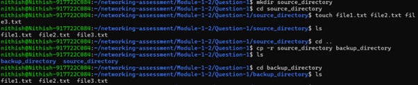
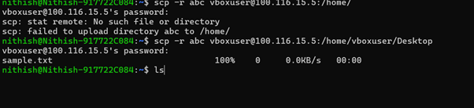

# Question 1  
## Copying a Folder with Multiple Files to a Destination Path (Using `cp` and `scp` in Linux)

---

Consider a scenario where a folder contains multiple files and needs to be copied to a destination path. Demonstrate how to perform this operation using both `cp` (local copy) and `scp` (remote copy) commands in Linux.

---

## Concepts Learned

### cp Command (Local Copy)

The `cp` command is used to copy files and directories within the same machine.

To copy an entire folder along with all its subdirectories and files, the `-r` (recursive) option must be used:

### SCP Command 

The `scp` command is usded to copy the files from the another machine over the same network

To copy an entire folder along with all its subdirectories and files, the `-r`

## Output Screenshot

### Using cp command

### Using scp command

### Saved in Destination

