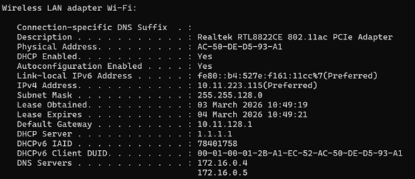
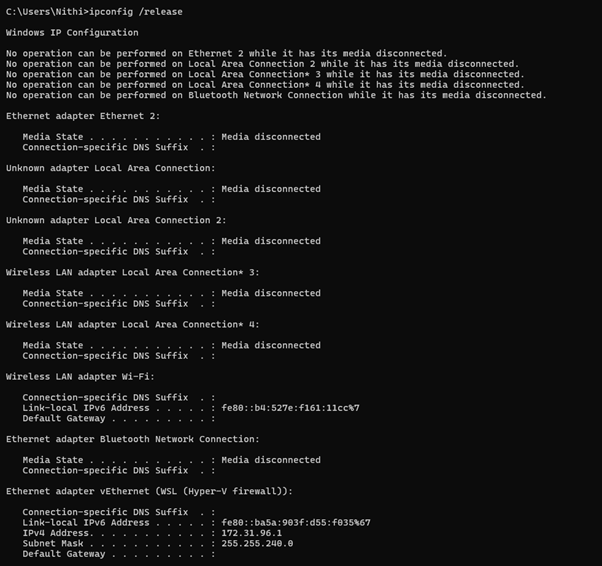
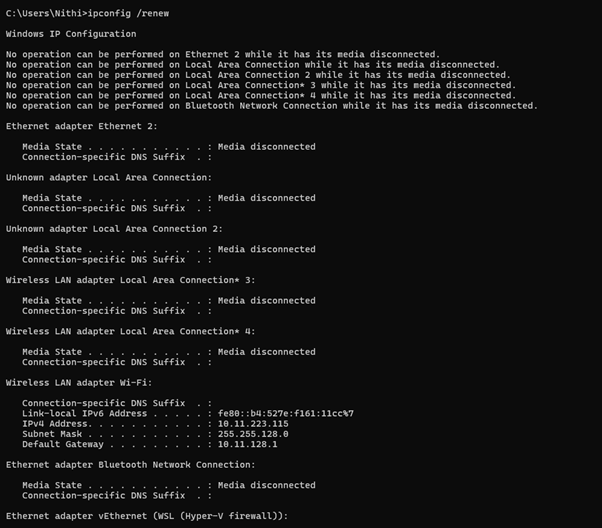
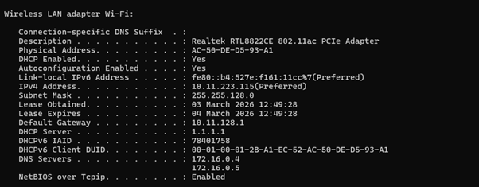

# Question 10
## Explain how a DHCP server assigns IP addresses to devices in your network.

---

## Concepts Learned

### DHCP (Dynamic Host Configuration Protocol)

Learned about the DORA (Discover , Offer , Request , Acknowledge) . if `dhcp` is disabled , we need to manually assign the IP to the devices. 
IF `DHCP` is down, windows will automatically assing `168.254.XX.XX` (APIPA : Automatic Private IP Addressing)

## Output Screenshot

### I connected to my College Wifi (which uses DHCP ) and Release that wifi and connected again to my College . Understand that IP is automatically assigned with the help of change in the Lease Time. 

