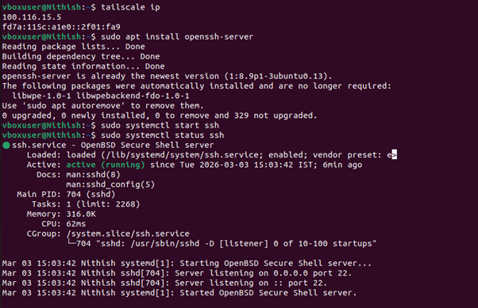
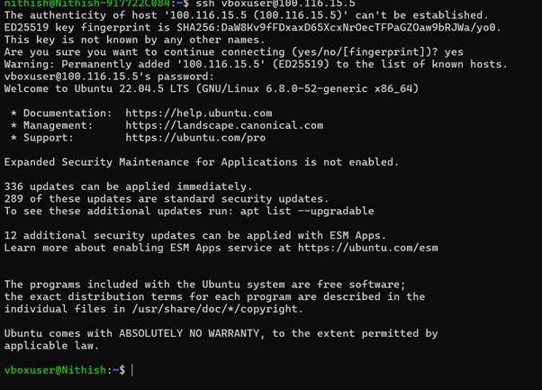
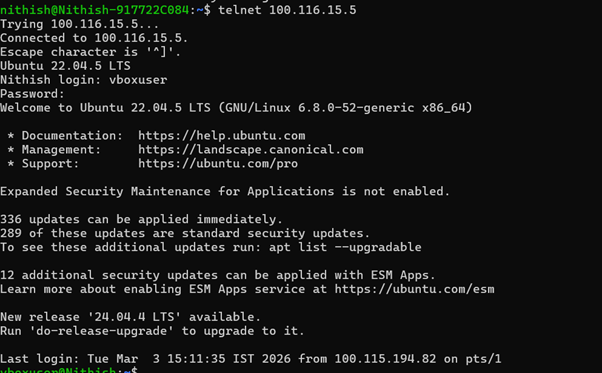

# Question 11  
## Using a terminal, connect to a remote machine via SSH and telnet.

---

## Concepts Learned

### Connecting Remote Machine using SSH and telnet

Learned about the encryption while connecting the machine using SSH meanwhile connecting the remote machine using the telnet is not encrypted.

## Output Screenshot

### activating ssh server

### Connecting to my Oracle Virtual Box using SSH

### Connecting to my Oracle Virtual Box using Telnet

