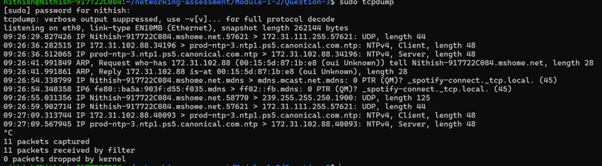
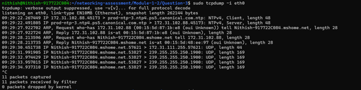
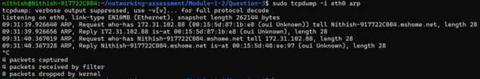
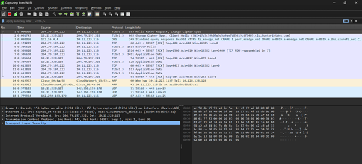
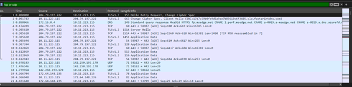
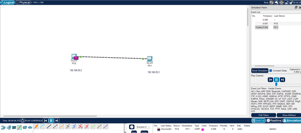
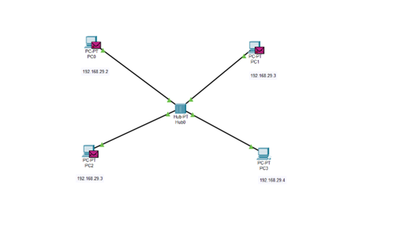
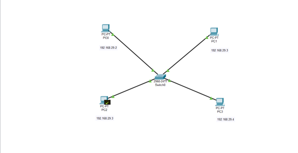

# Question 3
## Explore with Wireshark/TCP-dump/cisco packet tracer tools and learn about packets filters.

---

## Concepts Learned

### tcpdump

Learned about the `tcpdump` command and explored how it captures network packets.

### Wireshark

Explored the `Wireshark` tool and learned how to capture packets from specific network interfaces. Additionally, explored how to filter ARP, ICMP, and TCP packets separately.

### Cisco Packet Tracer

Explored how packets travel from one end device to another end device through switches and routers.

## Output Screenshot

### tcpdump Packet Capturing 

### tcpdump Packet Capturing for Specific Interface

### tcpdump Packet Capturing for Specific Protocol (Eg . ARP)

### Wireshark Tool Packet Capturing

### Wireshark Packet Capturing and Filter the packets based on specific protocols

### Cisco packet tracer (PC and Switch)

### Cisco Packet tracer Simulation (Two PC's)

### Cisco Packer tracer simulation (One Hub and 4 PC's)

### Cisco Packer tracer simulation (One Switch and 4 PC's)

