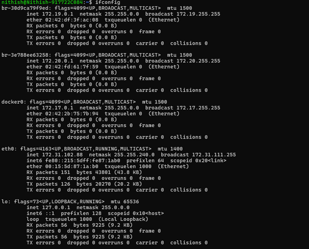
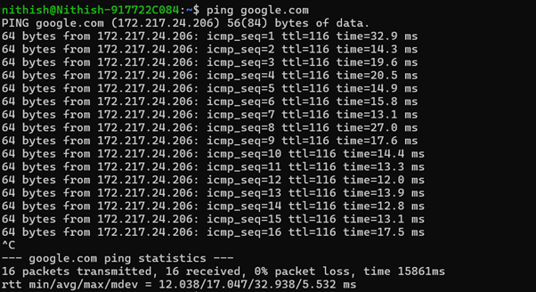
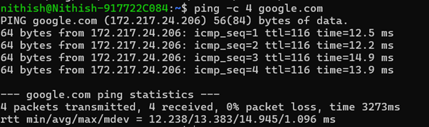
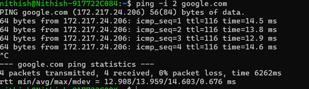

# Question 4
## Understand linux utility commands like - ping, arp (Understand each params from ifconfig output)

---

## Concepts Learned

### ping

The `ping` command is used to check whether the system is reachable or not.. It uses ICMP (Internet Control Message Protocol).

Learned about the parameters `-c` , `-i` , `-s` .

### ARP (Address Resolution Protocol)

the `arp` protocol is used to find the MAC address from the IP address. 

Learned about the parameters `mtu` which defines the maximum packet size that can be transmitted without fragmentation.

## Output Screenshot

### Displays current ARP cache on my Laptop.

### ifconfig

### Ping google.com

### Ping (with the no of packets mentioned)

### Ping (with frequency eg. for every 2 seconds)

