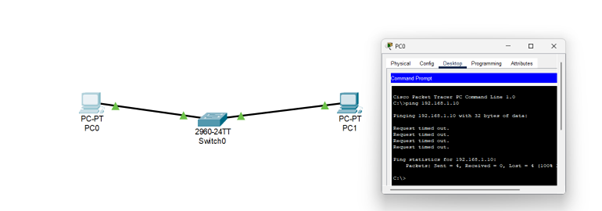

# Question 5
## Understand what happens when duplicate IPs configured in a network.

---

## Concepts Learned

### IP conflict 

The  results in unpredictable, erratic, and broken connectivity, as network switches and routers cannot distinguish between the two devices, causing packets to be dropped, sent to the wrong destination, or intermittent failures

## Output Screenshot

### Configured two PC's with a Same IP and Send the message from one PC to Another PC

