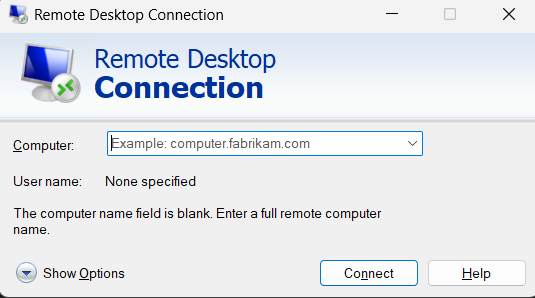

# Question 6  
## Understand how to access remote system using (VNC viewer, Anydesk, teamviewer and remote desktop connections)

---

## Concepts Learned

### VNC viewer, Anydesk, teamviewer and remote desktop connections

Explored about all the tools and understand how it connects the remote machines.

## Output Screenshot

### Remote Desktop Connection 

