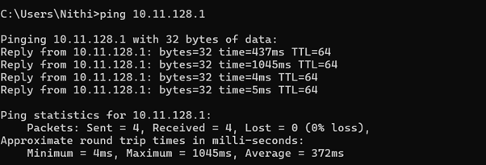

# Question 7 
## How to check your default gateway is reachable or not and understand about default gateway.

---

## Concepts Learned

### Default Gateway 

A `default gateway` IP is the address  that connects my local network to outside networks, such as the internet.

## Output Screenshot

### Checking whether my Default gateway is reachable or not 

