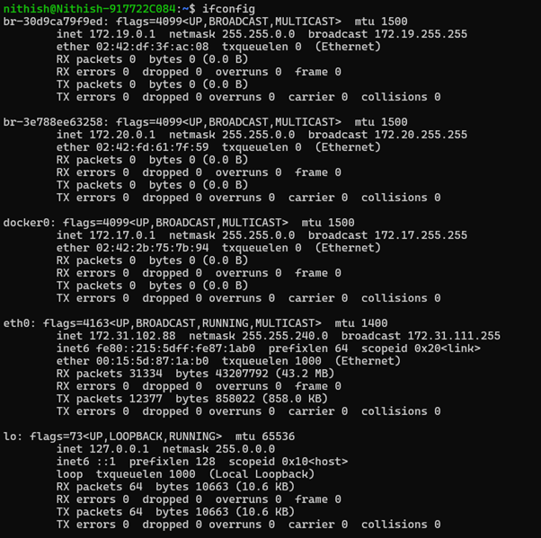
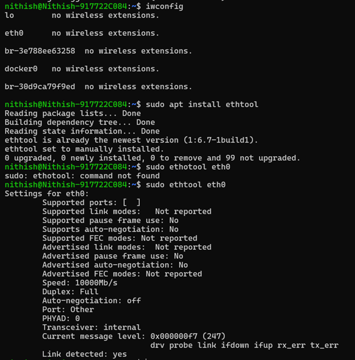

# Question 8
## Check iwconfig/ifconfig to understand in detail about network interfaces (check about interface speed, MTU and other parameters)

---

## Concepts Learned

### ifconfig/iwconfig

The `ifconfig` command is used to display and configure standard wired network interfaces (like Ethernet) and their general TCP/IP parameters. 
The `iwconfig` command is specifically designed to configure and display parameters for wireless network interfaces. 

## Output Screenshot

### ifconfig

### iwconfig

