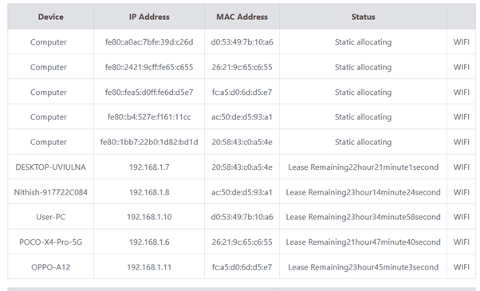

# Question 9
## Log in to your home router’s web interface (usually at 192.168.1.1 or 192.168.0.1) and check the connected devices list.

---

## Concepts Learned

Learned about how to find the details of my Airtel Fiber Wifi router. 

## Output Screenshot

### Airtel Router Connected Devices

