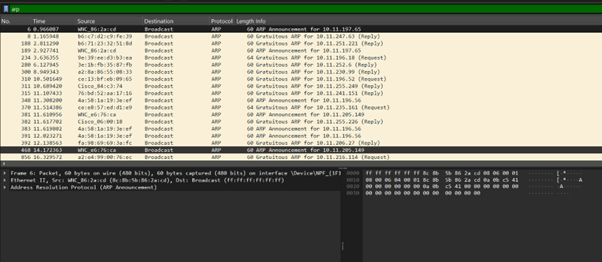
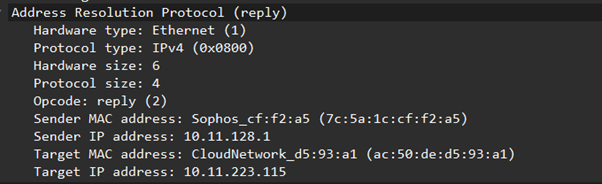
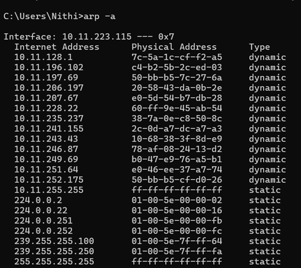

# Question 1
## 1)	Capture and Analyze ARP packets using wireshark. Inspect the ARP request and reply frames and discuss the role of sender IP and MAC address in these packets.

---

## Concepts Learned

### Address Resolution Protocol (ARP)
The **Address Resolution Protocol (ARP)** is used to map an IP address to a physical MAC address. This is a critical step because communication within Ethernet frames requires a MAC address, even if the IP is already known.

**Workflow Summary:**
* **Scenario:** A PC wants to ping `192.168.1.20` but lacks the destination MAC address.
* **ARP Request:** The PC broadcasts: *"Who has 192.168.1.20? Tell 192.168.1.10."*
* **ARP Reply:** The target machine responds: *"192.168.1.20 is at 08:00:27:ab:cd:ef."*

### ARP Request Analysis
During the analysis of a ping to the college WiFi router:
* **Sender IP:** `10.11.223.115`
* **Target IP:** `10.11.128.1`
* **Mechanism:** The request is sent as a **Broadcast** (Destination: `ff:ff:ff:ff:ff:ff`). This ensures all devices on the network receive the request, though only the target responds.

### ARP Reply Analysis
* **Mechanism:** The reply is sent as a **Unicast** frame directly to the requester.
* **Storage:** The requester saves this mapping in its **ARP cache table** for future communication to reduce network traffic.

---

## Output Screenshot

### Filtering the ARP packets in WireShark

### Ping to my College Wifi Router and analysing the ARP Packets

Who has 10.11.128.1 ?

