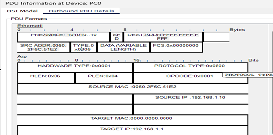
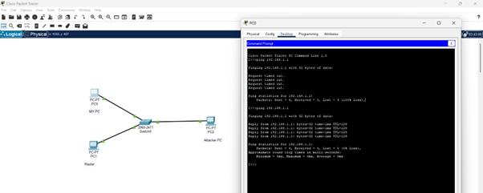
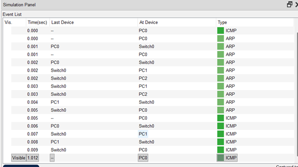

# Question 1
## Using Packet Tracer, Simulate an ARP Spoofing attack. Analyse the behaviour of the devices on the network, When they receive a Malicious ARP Response.

---

## Concepts Learned

### ARP Spoofing
Malicious Device Sends the fake ARP reply in order to convince the devices that is connected to the network.
* **Attacker MAC = Target IP**
* **PC:** Who has 192.168.1.1?
* **Router:** 192.168.1.1 is at AA:BB:CC:DD
* **But in spoofing (Attacker):** 192.168.1.1 is at FA:KE:MA:C1

How the PC sends all the Messages to the Attacker MAC address and this allows the attacker to become a MAN IN THE MIDDLE (MITM).

### Simulation Steps and Device Behaviour
1. **Ping 192.168.1.1:** First it generated the ICMP packet.
2. **ARP Resolution:** PC0 starts the ARP resolution.
3. **PC0 -> Switch:** Sends an ARP Request. Who has 192.168.1.1? Tell 192.168.1.1. Destination Address is Broadcasted.
4. **Switch Broadcast:** Now Switch Broadcast the ARP Request to all the devices connected to it except the sender.
   * It sends the Request to PC1 (Router).
   * It sends the Request to PC2 (Attacker PC). 
5. **ARP Reply:** The devices which has the IP 192.168.1.1 will give the ARP reply. In our case PC1 -> Switch0 (Gives the Reply) -> PC0. ARP Reply is unicast. Then it stores the MAC address in the PC0’s ARP Cache table.

6. **Concept of ARP spoofing:** If Attacker replies first, then the Attacker Devices becomes the gateway leading the attacker to become a Man In The Middle (MITM). This happens because ARP has no authentication.

**If the attacker replies first:**
* **PC2 -> PC0:** 192.168.1.1 is at attacker_MAC.
* Then PC0 updates its ARP table incorrectly.
* Now communication becomes: **PC0 -> PC2 -> PC1**.

### Attacker Capabilities
Now the attacker can able to:
* Monitor traffic
* Modify packets
* Drop packets

---

## Output Screenshot

### Learns the MAC Address of the Router (ARP table)

### Simulation Panel

 
