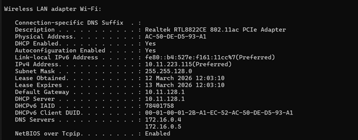
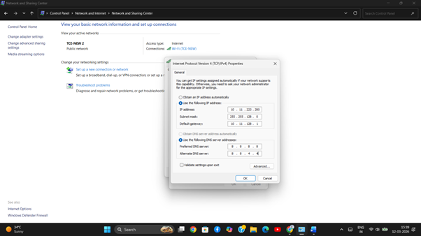
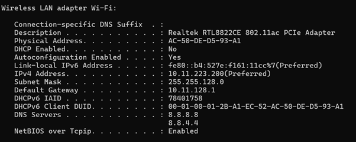
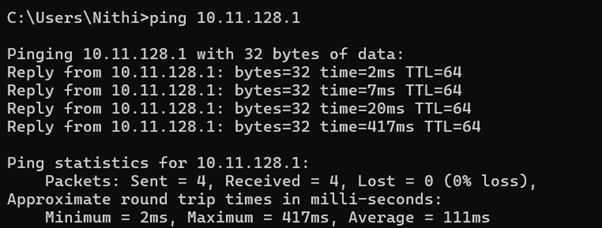

# Question 3
## Manually  Configure Client Ips on static devices and verify connectivity using ping.

---

### My laptop conntected to my wifi has IP allocated by DHCP with the lease time

### Manually Configured the IP in my Laptop

### Checking the connectivity using Ping

