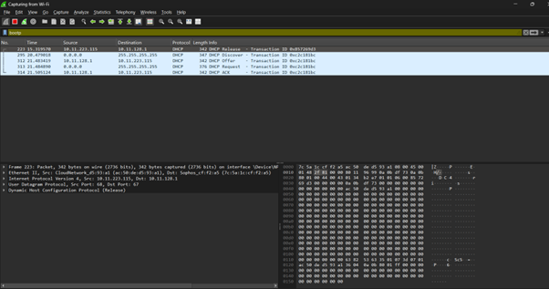

# Question 3
## DHCP Process Analysis using Wireshark

---

## Concepts Learned

The DHCP process was triggered by releasing and renewing the IP address using the commands:
* `ipconfig /release`
* `ipconfig /renew`

A filter **bootp** was applied in Wireshark to display only DHCP packets.

### a) DHCP Discover
Client sends a broadcast message to find the available DHCP Servers in the network.
* **Observation in wireshark:**
  1. Source IP : 0.0.0.0
  2. Destination IP : 255.255.255.255
  3. Protocol : DHCP
  4. Message Type : Discover
* **Note:** At this stage client does not assigned to any IP address. So it broadcast discover message to all the devices in the network and checking if any DHCP server is available in the network to assign an IP.

### b) DHCP offer
The DHCP server responds with an offer which contains an IP address and respective network parameters.
* **Observation in wireshark:**
  1. Source : DHCP Server (10.11.128.1)
  2. Destination : Client
  3. Message Type : Offer

### c) DHCP request
The client request the offered IP address to the DHCP server.
* **Observation in wireshark:**
  1. Source : Client
  2. Destination : Broadcast
  3. Message Type : Request

### d) DHCP Acknowledge
The DHCP server confirms the allocation of the IP address.
* **Observation in wireshark:**
  1. Source : DHCP Server
  2. Destination : Client
  3. Message Type : ACK

---

## Output Screenshot

### DHCP DORA Process Capture

