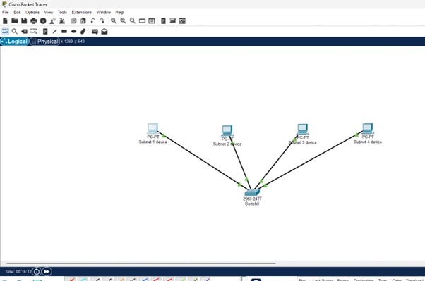
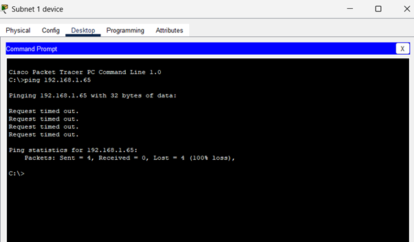

# Question 4
## IPV4 Addressing and Subnetting Calculation

---

## Concepts Learned

### IPV4 address:
AAAAAAAA : BBBBBBBB : CCCCCCCC : DDDDDDDD
Network : Network : Network : Host 

* First 24 bits are reserved for the Network
* Last 8 bits are reserved for the host
* Total no of unique devices can be connected : 2^8 = 256 – 2 = 254 (2 -> 1 for Network Id and 1 for Broadcast address).

### Goal:
192.168.1.0 \24 : 4 subnets

**2^n = no of subnets**
* If I borrow 1 bit from the host. I can able to divide the network into 2 subnets (2^1 = 2)
* If I borrow 2 bit from the host. I can able to divide the network into 4 subnets (2^2 = 4) 

The question asked us to divide the network into 4 subnets .. so we need to borrow 2 host bits .. then the total reserved bits for the network becomes /26.

### Subnet mask concept
If it is /24 :
N -> Network bits
H -> Host bits
NNNNNNNN: NNNNNNNN: NNNNNNNN : HHHHHHHH

In order to create a 4 subnet we need to borrow 2 host bit
So:
NNNNNNNN: NNNNNNNN: NNNNNNNN: HH : HHHHHH

The new subnet mask will become **255: 255: 255: 192 (128+64)**

### Finding Subnet ranges
Block size = 256 – last octet of subnet mask
In our case:
256 – 192 = 64 (Jumps by 64 for every bit upto 192)
0 -> 64 -> 128 -> 192

### Building subnets: 

**192.168.1.0 - 192.168.1.63 (Subnet 1)**
* Network address : 192.168.1.0
* Broadcast address : 192.168.1.63
* No of usable hosts : 192.168.1.1 – 192.168.1.62

**192.168.1.64 - 192.168.1.127 (Subnet 2)**
* Network address : 192.168.1.64
* Broadcast address : 192.168.1.127
* No of usable hosts : 192.168.1.65 – 192.168.1.126

**192.168.1.128 - 192.168.1.191 (Subnet 3)**
* Network address : 192.168.1.128
* Broadcast address : 192.168.1.191
* No of usable hosts : 192.168.1.129 – 192.168.1.190

**192.168.1.192 - 192.168.1.255 (Subnet 4)**
* Network address : 192.168.1.192
* Broadcast address : 192.168.1.255
* No of usable hosts : 192.168.1.193 – 192.168.1.254

### Network Communication
* Devices in the same network can able to communicate through a switch
* Devices the different network communicate through the router

---

## Output Screenshot

Pinging from subnet 1 device to subnet 2 device .
Request timed out Because they are in different subnets.

