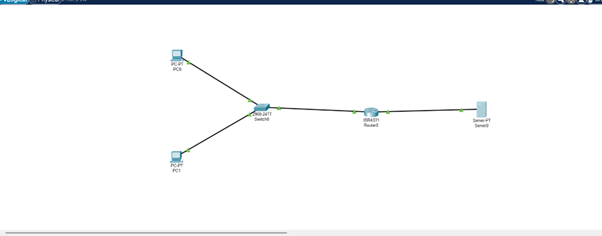
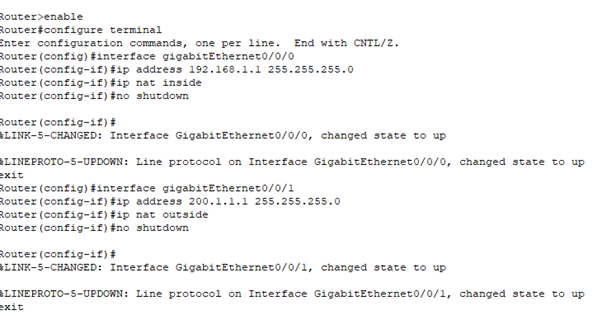
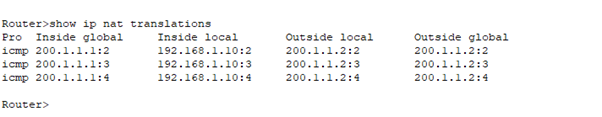
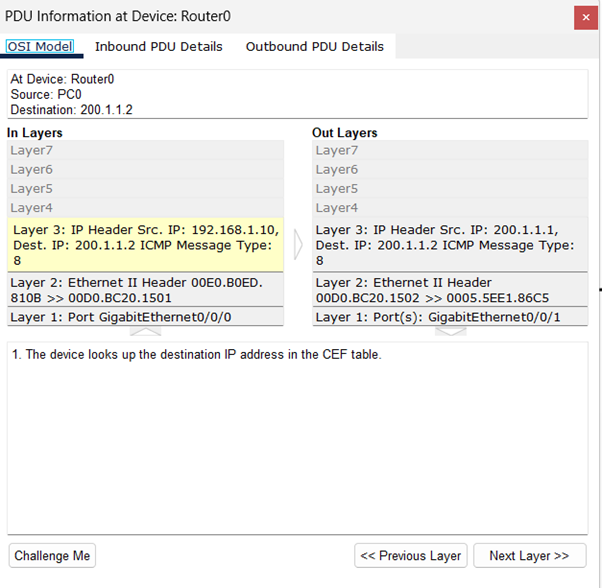
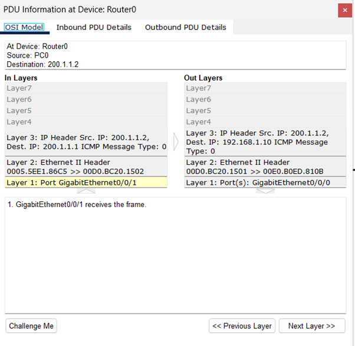

# Question 7
## Network Address Translation (NAT) Configuration and Analysis

---

## Concepts Learned

### Topology built in my cisco packet tracer
The network setup consists of an internal private network and an external public network connected through a router.

**Internal Network:**
* PC0 (192.168.1.10)
* PC1 (192.168.1.20)
* Switch

**Outside Network:**
* Router (Internal: 192.168.1.1 | Internet side: 200.1.1.1)
* Server (200.1.1.2)

### Why NAT is needed?
Private IP addresses can’t travel on the internet.
PC0 sends a packet like:
* **Source IP** = 192.168.1.10
* **Destination IP** = 200.1.1.2

The router must replace the source IP.
* **Before NAT:** 192.168.1.10 → 200.1.1.2
* **After NAT:** 200.1.1.1 → 200.1.1.2

So the internet thinks the packet came from router public IP. That is the main idea of NAT.

### Router Configuration
The following commands were used to configure the router:

### Enabling NAT inside Router

`access-list 1 permit 192.168.1.0 0.0.0.255`

Meaning: Allow NAT for all devices in 192.168.1.0/24 network.

In my topology, the PCs use private IP addresses (192.168.1.x) and the router translates them to the public IP (200.1.1.1) when communicating with the external server.

Output Screenshot
Before NAT and After NAT Analysis

