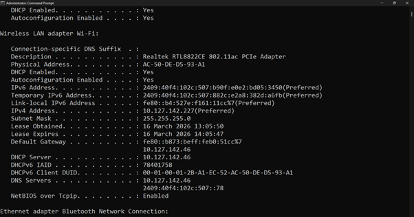
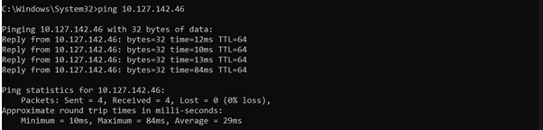

# Question 1  
## Capture and analyse ARP Packets using wireshark. Inspect the ARP Request and ARP reply frames when your device attempts to find your router’s MAC address. Discuss the importance of ARP in packet forwarding. 

---

# Understanding Address Resolution Protocol (ARP)

This document provides a concise overview of how ARP functions within a Local Area Network (LAN) to facilitate communication between devices.

---

## The ARP Process

### 1. ARP Request (Broadcast)
When a device needs to communicate with another (e.g., the Router) but does not know its hardware address, it sends an **ARP Request**.

* **Source IP:** Your Device IP
* **Destination IP:** Router’s IP
* **Source MAC:** Your Device MAC
* **Destination MAC:** `FF:FF:FF:FF:FF:FF` (Broadcast address)

> **Note:** Because the destination MAC is unknown, the request is broadcast to all devices connected to the network.

### 2. ARP Reply (Unicast)
The device assigned the target IP address (the Router) responds with an **ARP Reply**.

* The Router replies with its specific MAC address.
* The packet is **Unicast**, meaning it is sent directly from the router back to your device.

### 3. ARP Caching
Once your device learns the MAC address:
* It stores the mapping in the **ARP Table**.
* You can view this table using the command: `arp -a`

---

## Importance of ARP in Networking

1.  **Layer Interoperability:** IP addresses operate at **Layer 3** (Network Layer), but actual communication in a LAN happens at **Layer 2** (Data Link Layer) using MAC addresses.
2.  **Addressing Gap:** When a device sends a packet to another device or the gateway in a LAN, it *must* know the destination MAC address to encapsulate the frame.
3.  **Resolution:** ARP is the bridge that resolves a known IP address into a physical MAC address.
4.  **Critical Dependency:** Without ARP, IP communication inside the LAN would fail because Ethernet relies exclusively on MAC addresses for data delivery.

## Output Screenshot

### My Connected Router’s Default Gateway is 10.127.142.46

### Checking the Reachability using Ping

### ARP Request and Reply 

