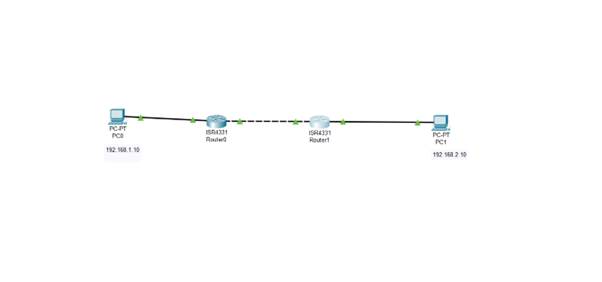
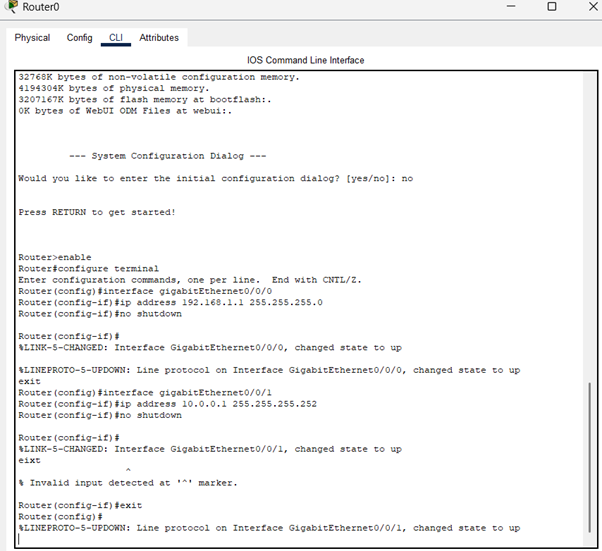
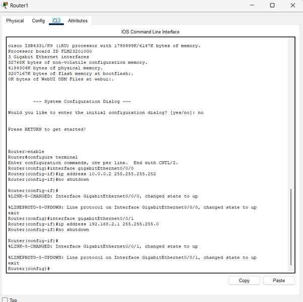
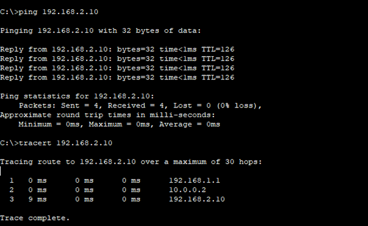

# Question 2 
## Manually configure static routes on a router to direct packets to different subnets.
Use the ip route command and verify connectivity using ping and traceroute.

---

## Description 

### Topology For demonstration 

PC0 ---- Router1 ---- Router2 ---- PC1

### Goal Of the Question

Goal of the question : 

We have two different LANs.

LAN 1 on the Left  and LAN 2 on the right.

Router only knows the devices that is Directly connected to them.

So if one PC wants to reach a PC in another network, the routers must be told:

“For that remote network, send packets to this next router.” (Static Routing)

## Output Screenshot

### Topology in Cisco Packet Tracer

### Router 0 Configuration 

### Router 1 Configuration 

Static Route Configuration 

In Router 0 

ip route 192.168.2.0 255.255.255.0 10.0.0.2

in order to reach the network 192.168.2.0 , send packets to next hop 10.0.0.2

In Router 1

Ip route 192.168.1.0 255.255.255.0 10.0.0.1

In order to reach the network 192.168.1.0 , send packets to next hop 10.0.0.1

PC0 sees 192.168.2.10 is not in its own subnet

So it sends packet to default gateway 192.168.1.1

Router0 checks routing table

Router0 sees static route:

•	192.168.2.0/24 via 10.0.0.2

Router0 forwards packet to Router1

Router1 sees 192.168.2.10 is directly connected

Router1 forwards packet to PC1

PC1 replies back using the reverse path

Router1 forwards packet to PC1
PC1 replies back using the reverse path

