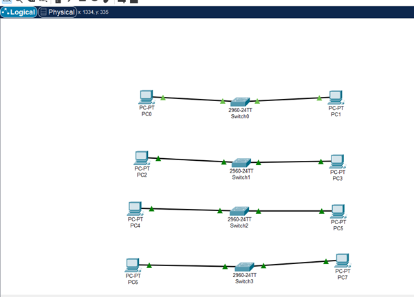
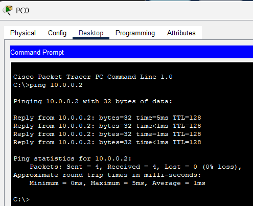
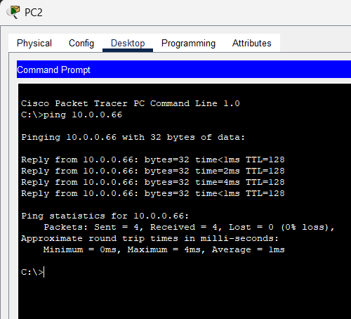
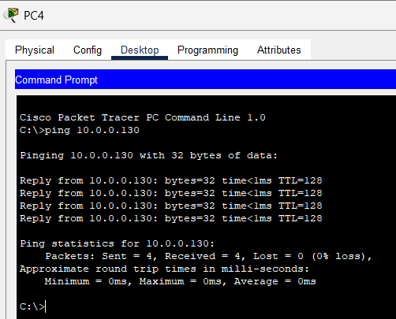
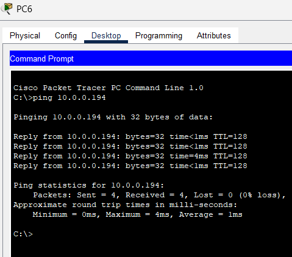
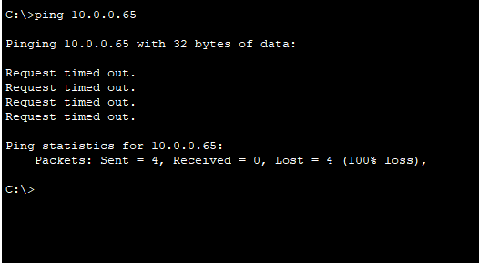

# Question 3  
## Given a network address of 10.0.0.0/24, divide it into 4 equal subnets.,Calculate the new subnet mask.,Determine the valid host range for each subnet.,Assign IP addresses to devices in Packet Tracer and verify connectivity.

---
a)	Calculate the new subnet mask

Given IP address 

10.0.0.0 /24

/24 :-  24 network bits and 8 host bits.

The goal of the question is to divide the network into 4 equal subnets.

2^2 = 4

We need 2 host bits in order to divide the network into 4 equal subnets.

/24 + 2 = /26.

The new subnet mask for this network becomes :- 255.255.255.192 (128+64)

b)	Determine the valid host range for each subnet.

Block size = 256-192 = 64 

Starting of the subnets :- 0,64,128,192

Subnet	Network Address	First Usable  Host	Last Usable Host	Broadcast

1	10.0.0.0/26	  10.0.0.1	 10.0.0.62	10.0.0.63

2	10.0.0.64/26	10.0.0.65	 10.0.0.126	10.0.0.127

3	10.0.0.128/26	10.0.0.129 10.0.0.190	10.0.0.191

4	10.0.0.192/26	10.0.0.193 10.0.0.254	10.0.0.255
				

c)	Assign IP address to devices in the packet tracer and verify connectivity using ping.

### Topology

### PC0

### PC2

### PC4

### PC6

### Tring to reach one subnet to another subnet

