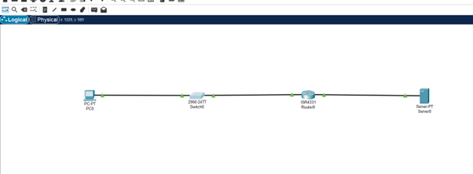
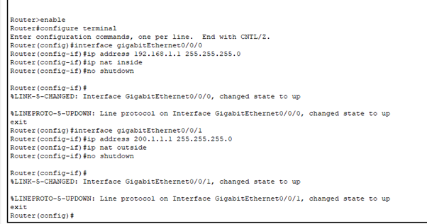
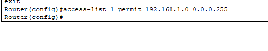
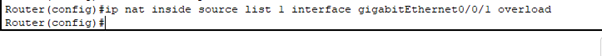
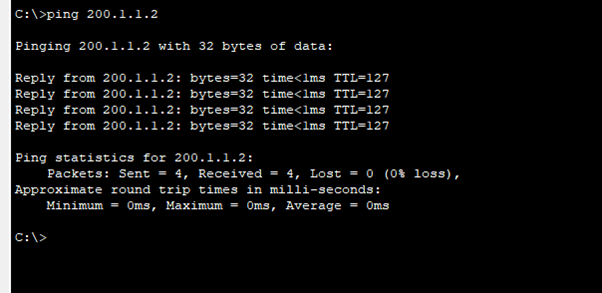
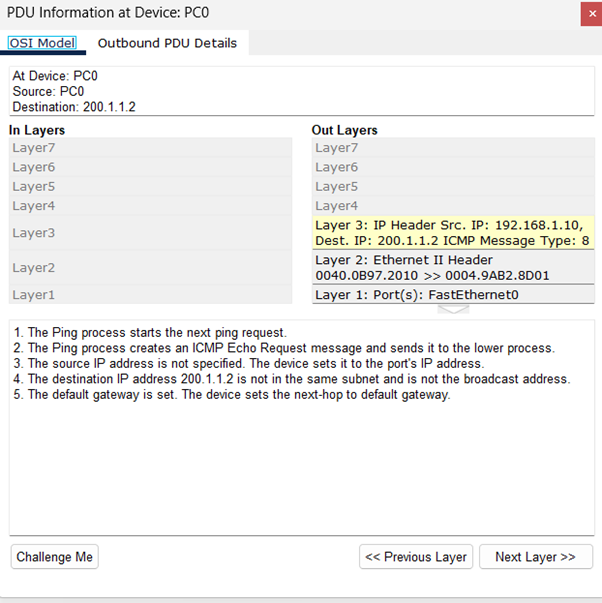
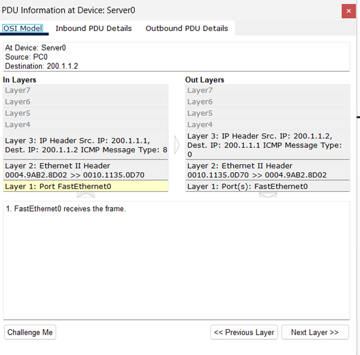
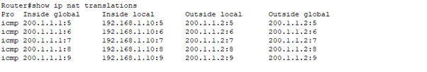

# Question 5
## In Cisco Packet Tracer, configure NAT on a router to allow internal devices (192.168.1.x) to access the internet.

•	Test connectivity by pinging an external public IP.

•	Capture the traffic in Wireshark and analyze the source IP before and after NAT translation.

---

### Topology

### Router Configuration

### Allowing the NAT for internal network 192.168.1.0

### Translation of Private IPs using router's Public IP

### Accessing the internet from the Private IP device

### Before NAT

### After NAT

### NAT Table

