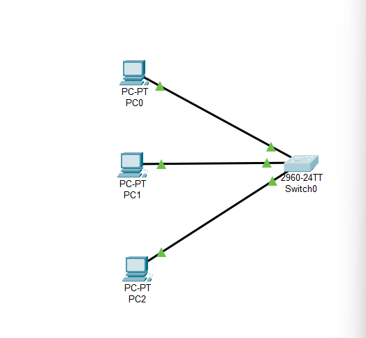
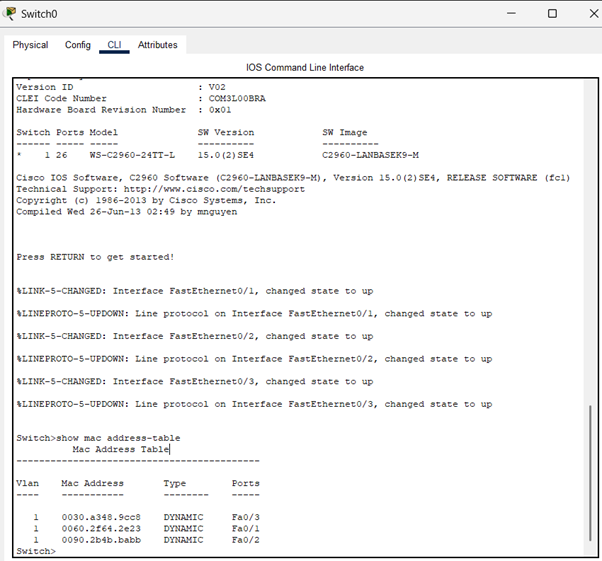
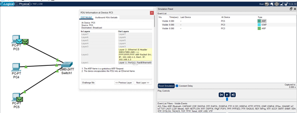
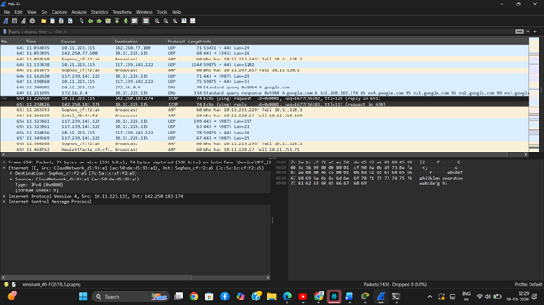
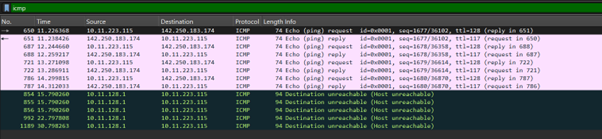
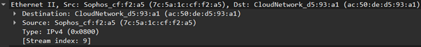

# Question 1  
## Simulate a small network with switches and multiple devices. Use ping to generate traffic and observe the MAC address table of the switch. Capture packets using Wireshark to analyze Ethernet frames and MAC addressing.

---

## Concepts Learned

### Switch

It will connect `end devices` . It works based on the MAC address of the system.

### MAC

Physical address of the network card. CAM(Content Addressable Memory) table will maintains the MAC address of the system. 

## Output Screenshot

### Configuration of 3 PC's and 1 Switch

### CAM table 

### Analyzing Packets in the simulated environment

### Packet Capturing in WireShark

### Packet Filtering in WireShark

### Analyzing Ethernet Frames in WireShark

