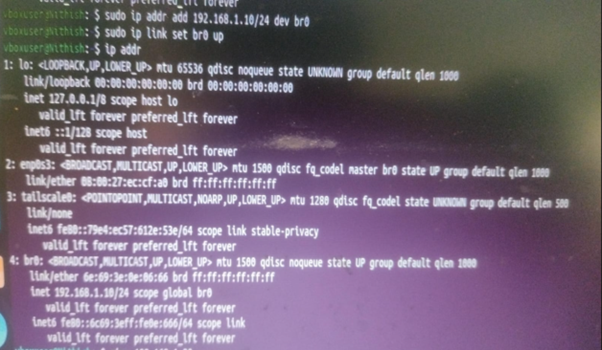
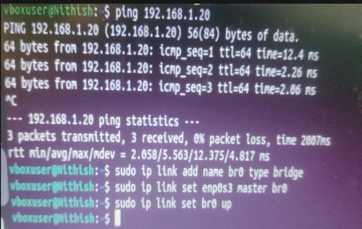
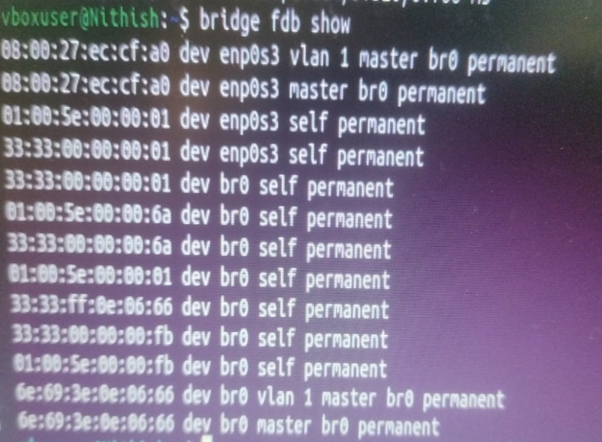

# Question 10
## Use Linux to view the MAC address table of a switch (if using a Linux-based network switch). Use the bridge or ip link commands to inspect the MAC table and demonstrate a basic switch's operation.

---

## Concepts Learned

### Setting up bridge between two VM's

`sudo ip addr add <IP> dev br0`
`sudo ip link set br0 up`
`btidge fdb show`

## Output Screenshot

### Setting up the Bridge in my VM1

### Adding the IP to the Created Bridge

### Bridge Acts like a Switch (Learns all the MAC address)

