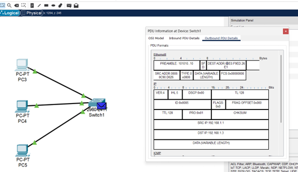

# Question 2
##  Capture and analyze Ethernet frames using Wireshark. Inspect the structure of the frame, including destination and source MAC addresses, EtherType, payload, and FCS. Use GNS3 or Packet Tracer to simulate network traffic.

---

## Concepts Learned

### Ethernet Header

`Destination Address` : MAC address of the receiving device.

`Source Address` : MAC address of the Sender device.

`Type` : Contains what is the protocol is being used in the ethernet. (0X0800 : IPV4 , 0X0806 : ARP , 0X08DD : IPV6)

`Data` : Contains acutal data carried inside the frame.

`FCS` : Frame Check Sequence , It is used for error detection (32 bit) ( Corruption of frames during transmission) . It uses Cyclic Redundancy Check) Algorithm.. it shows 0x000.. means the NIC (Network Interface Card) automatically verifies it . 

## Output Screenshot

### Ethernet Header

### Cisco Packet tracer simulation mode PDU Details

### Saved in Destination

