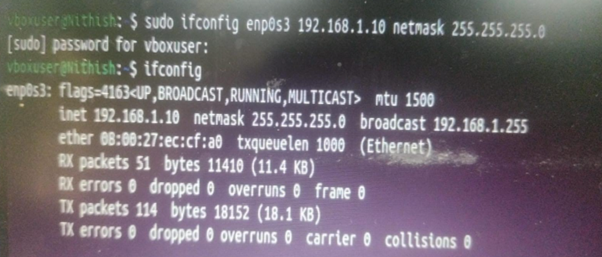
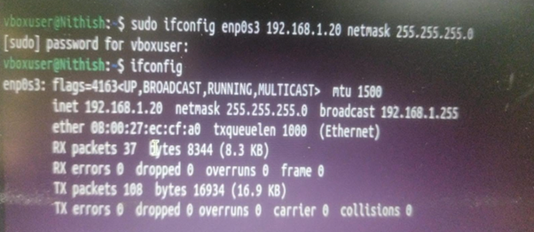
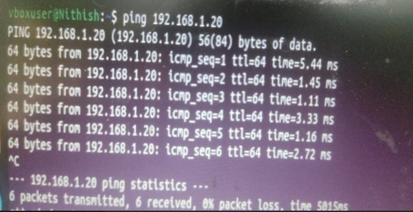
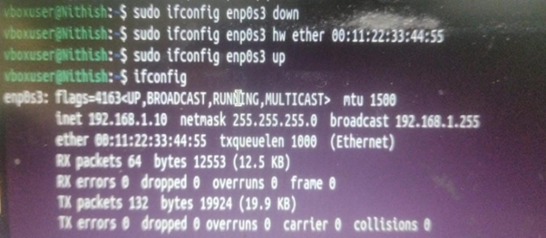

# Question 3
## Configure static IP addresses, modify MAC addresses, and verify network connectivity using ping and ifconfig commands.

---

## Concepts Learned

### Manually Configure static IP address

`sudo ifconfig <Interface> <modified-iP>`

### Modify the MAC address

`sudo ifconfig <Interface> hw ether <modified-mac>`

T

## Output Screenshot

### Manually Configuring the IP of My VM1

### Manually Configuring the IP of My VM2

### ping the IP of my VM2 from VM1

### Modifying the MAC address

