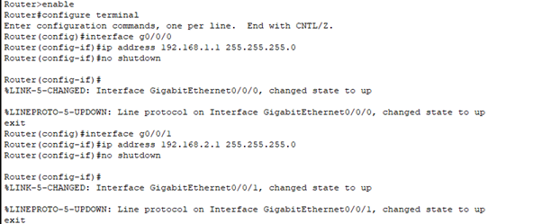
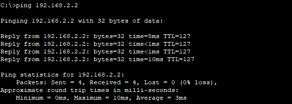
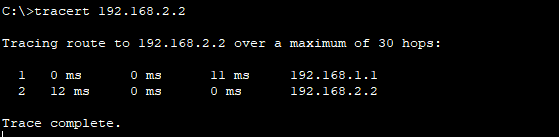
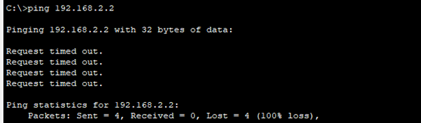
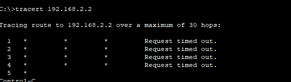

# Question 4
## Troubleshoot ethernet communication using ping and traceroute. Using cisco packet tracer.

---

## Output Screenshot

### Used 2 PC's , 2 Switches and one router in order to demonstrate this.

### Router Configuration in Cisco Packet Tracer

### Checking if the Network is reachable or not

### Used TraceRoute in order to identify the Packet Flow (HOPS)

### Removed the Default Gateway from PC0 in order to perform troubleshooting

### TraceRoute After removed the default gateway

### Conclusion
PC0  is sending packets.. but it is not even reached the first hop properly. So we can identify that there is an issue with the local configuration of the system. 

