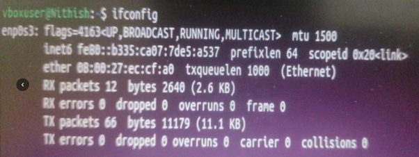
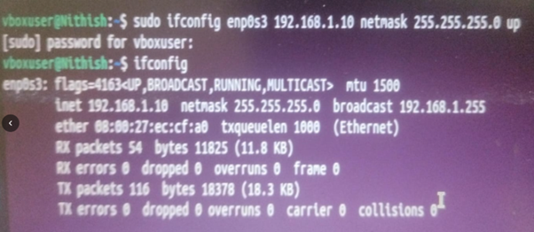
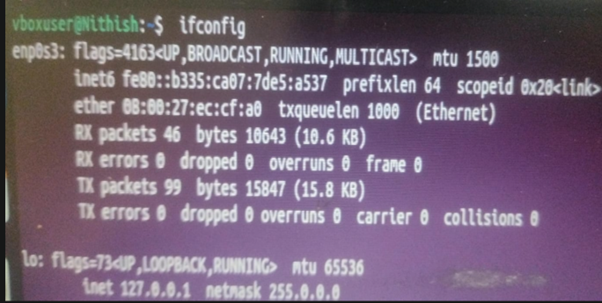
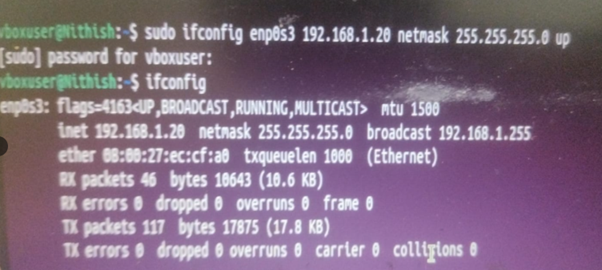
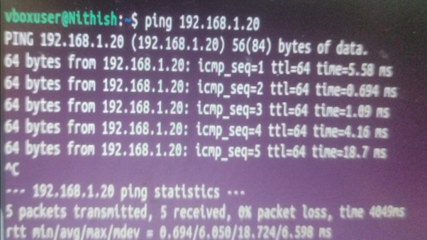
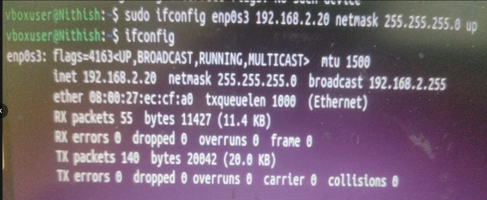
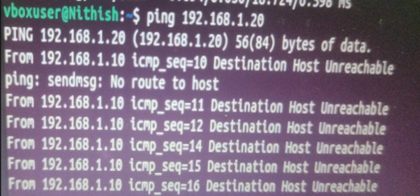

# Question 6
## Ping from one machine to the other. If it fails, use ifconfig to ensure the IP addresses are configured correctly

---

## Output Screenshot

### VM1

### Configuring IP

### VM2

### Configuring IP

### Checking whether the Network in VM2 is reachable or not

### Modifying the IP for Troubleshooting issue using ping

### Modifying the IP for Troubleshooting issue using TraceRoute

