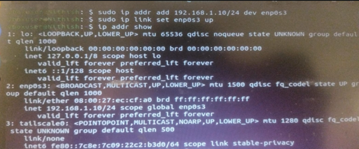

# Question 9
## Describe how you would configure a basic LAN interface using the ip command in Linux (kernel.org).

---

## Concepts Learned

The `sudo ip addr add <IP> dev <Interface>` is used to manually configure the IP (Modern). It belongs to iproute2 package

## Output Screenshot

### Manually Configuring ip using ip addr

