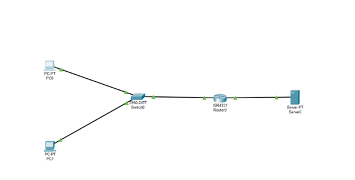
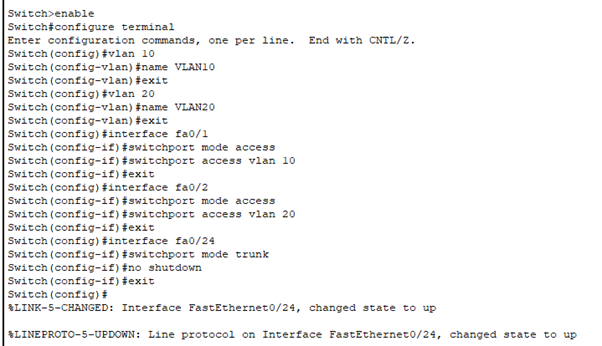
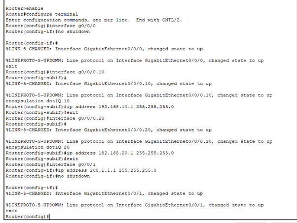
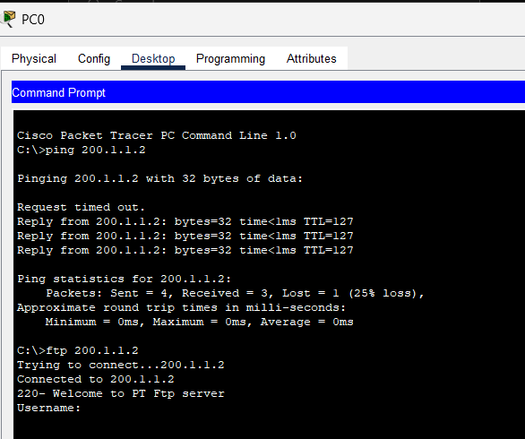
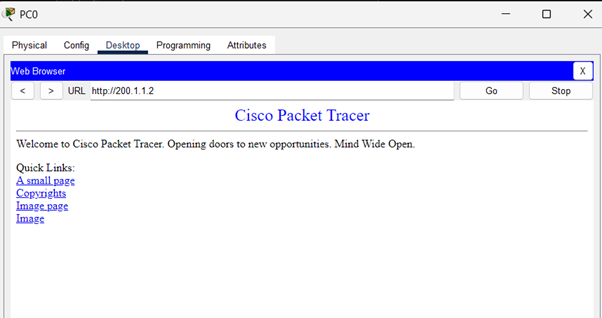
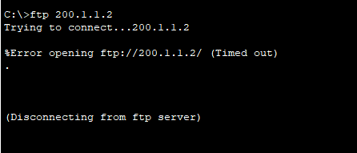
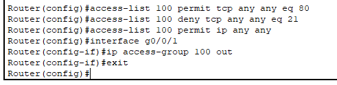

# Question 11

---

Topology

HTTP and FTP connection was allowed before applying ACL

Now the problem is being solved by utilizing the concept of inter VLAN routing 

After applying ACL :

FTP is blocked Because of applying ACL

