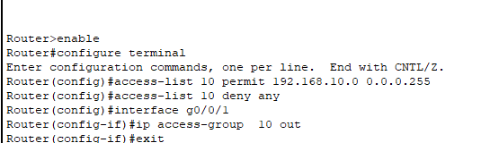
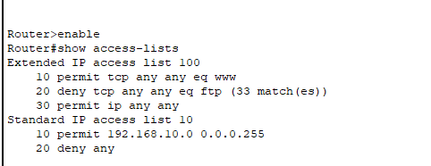
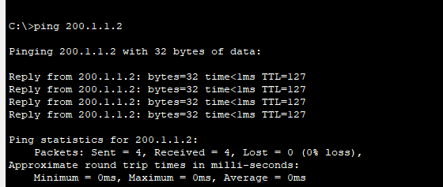
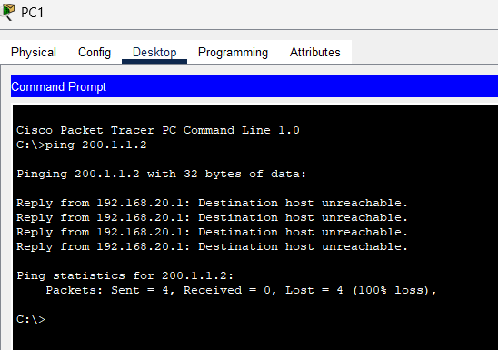

# Question 12

---

Allowing only the source IPs 192.168.10.x

192.168.20.x is blocked

HTTP and FTP connection was allowed before applying ACL

Now the problem is being solved by utilizing the concept of inter VLAN routing 

After applying ACL :

FTP is blocked Because of applying ACL

