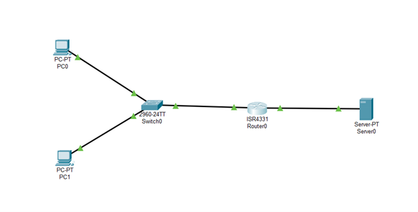
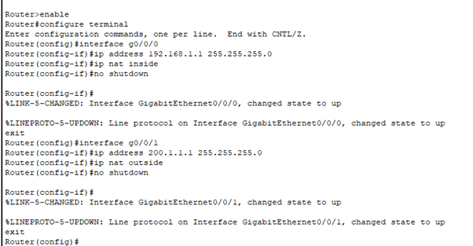
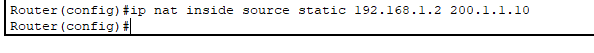
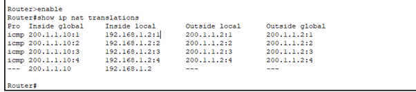
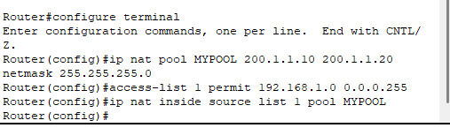
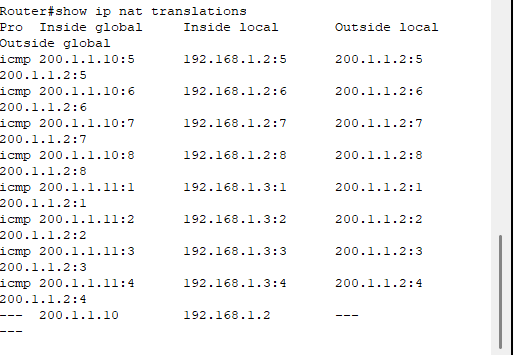
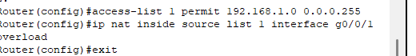
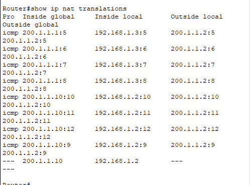

# Question 14

---

Static NAT

Static NAT maps the private IP to one fixed Public IP

2) Dynamic NAT

Dynamic NAT assigns IP from Pool in a randomized manner.

2) PAT

PAT allows multiple devices to share a single public IP using port numbers

