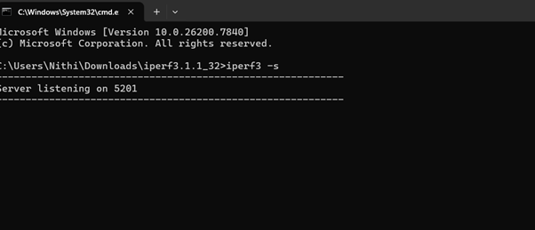
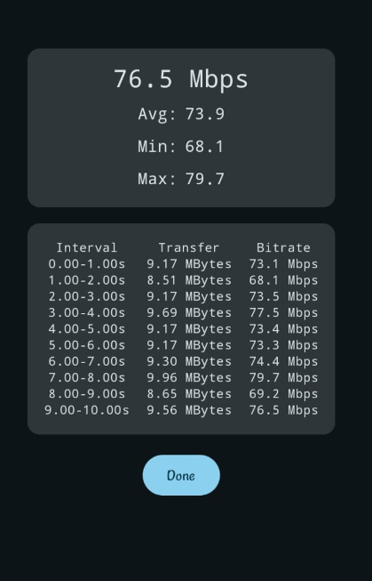
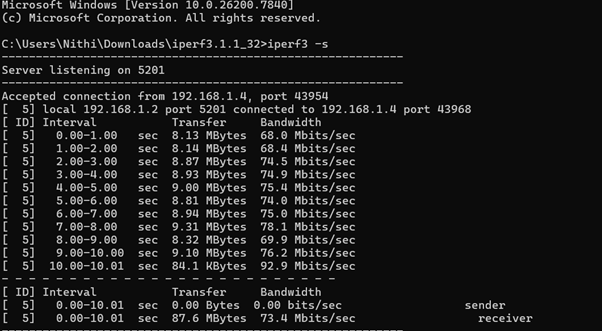
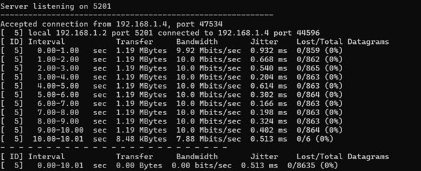
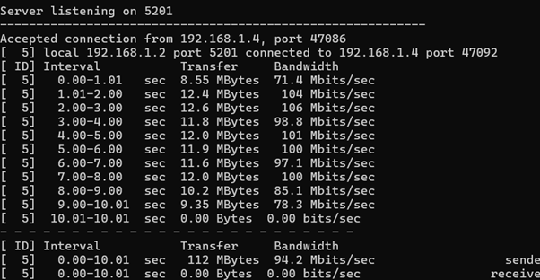

# Question 15

---

## Output Screenshot

IN phone

Transfer -> How much data is sent

Bitrate ->Effective throughput

UDP

Jitter -> Variation in Packet Arrival Timing, Low Jitter Is good for Voice , Video call and Gaming.

Packet Loss -> How many Packets are dropped.

Reverse Mode

Server sends traffic back to the client

Bidirectional

Both client and server sends traffic at the same time
Parallel
Connecting to host 192.168.1.2, port 5201
[320] local 192.168.1.4 port 39810 connected to 192.168.1.2 port 5201
[ ID] Interval           Transfer     Bitrate         Retr  Cwnd
[320]   0.00-1.00   sec  8.25 MBytes  69.0 Mbits/sec    0    127 KBytes       
[320]   1.00-2.00   sec  8.00 MBytes  67.2 Mbits/sec    3    132 KBytes       
[320]   2.00-3.00   sec  7.88 MBytes  66.0 Mbits/sec    1    132 KBytes       
[320]   3.00-4.00   sec  7.75 MBytes  65.0 Mbits/sec    3    132 KBytes       
[320]   4.00-5.00   sec  8.00 MBytes  67.1 Mbits/sec    0    132 KBytes       
[320]   5.00-6.00   sec  8.12 MBytes  68.2 Mbits/sec   23   91.9 KBytes       
[320]   6.00-7.00   sec  8.00 MBytes  67.1 Mbits/sec    1   91.9 KBytes       
[320]   7.00-8.00   sec  8.00 MBytes  67.1 Mbits/sec    0   91.9 KBytes       
[320]   8.00-9.00   sec  9.00 MBytes  75.5 Mbits/sec    1   91.9 KBytes       
[320]   9.00-10.00  sec  8.12 MBytes  68.0 Mbits/sec    0   91.9 KBytes       
- - - - - - - - - - - - - - - - - - - - - - - - -
[ ID] Interval           Transfer     Bitrate         Retr
[320]   0.00-10.00  sec  81.1 MBytes  68.0 Mbits/sec   32            sender
[320]   0.00-10.00  sec  80.6 MBytes  67.6 Mbits/sec                  receiver

iperf Done.
