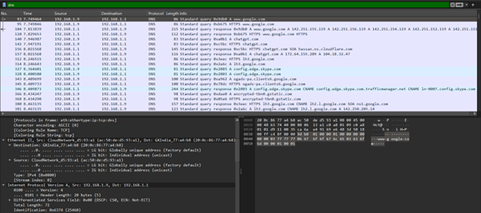
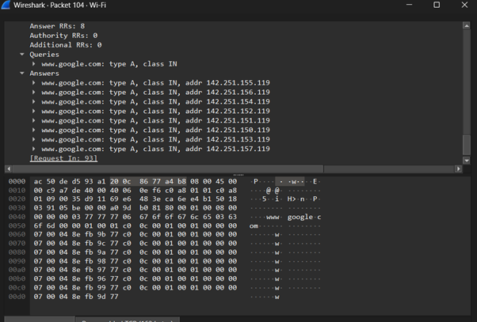
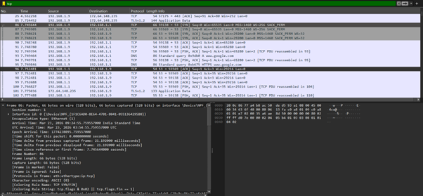
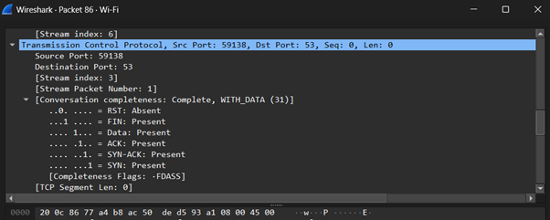
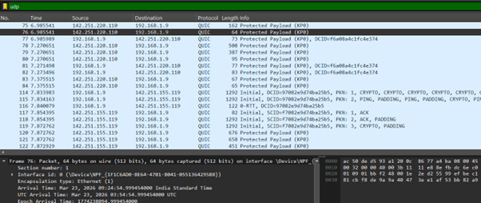
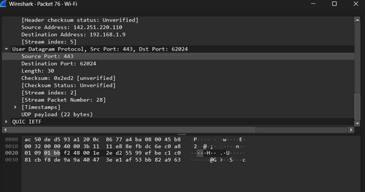
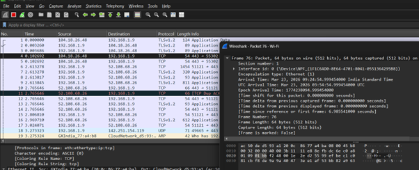

# Question 2
---

## Output Screenshot

Analysing the DNS Packets in Wireshark 

Query : Domain Name

Answers : Corresponding IP addresses

Analysing TCP Packets

SYN – Start Connection

SYN-ACK – Response

ACK – Acknowledge

FIN – Close the connection

TCP is a connection-oriented protocol. It establishes connection using a 3-way handshake (SYN, SYN-ACK, ACK) before data transfer.

Analysing UDP packets 

No Handshake involved. 

Not reliable.

Fast Communication

Analysing the Packet Header 

Packet Flow

1.	DNS Request
   
2. DNS Response
   
3. TCP SYN
   
4. TCP SYN-ACK
   
5. TCP ACK
    
6. Data transfer
    
7. FIN (connection close)

