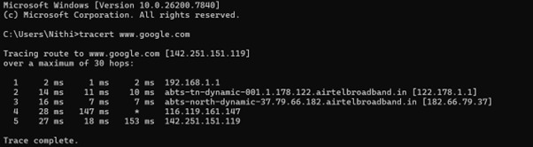

# Question 3
---

## Output Screenshot

1st HOP:

	Default gateway
  
	Latency is extremely low (2ms, 1ms) , This denotes that connection is healthy.
2nd and 3rd HOP:

	These are the first routers at the Internet Service Providers (ISPs)
  
4th HOP:

	Request timed out as Many core routers are configured to ignore "trace" requests (ICMP) to save CPU power for actual web traffic.
  
5th HOP:

	Google Server

