# Question 4,5,6
---

## Output Screenshot

Topology created in CISCO PACKET TRACER

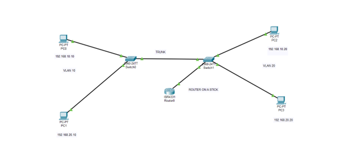

Configuration of Switch0 (Setting up access port and trunk ports)

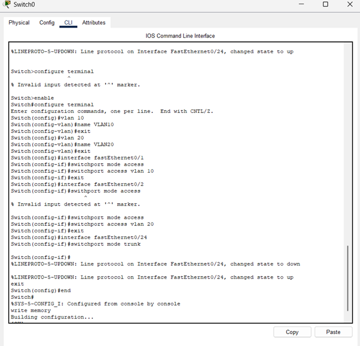

Configuration of Switch1 (with Access Ports and Trunk Ports)

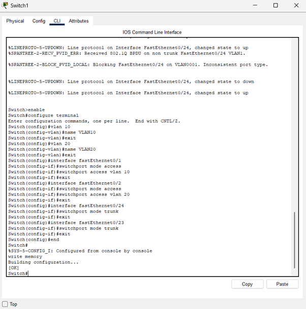

Configuring the routers and creating a subinterfaces for vlans

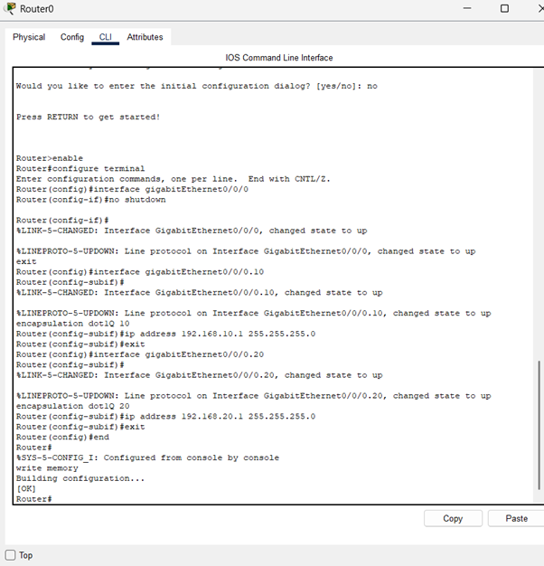

Testing Same VLAN communication by setting up the access ports

From PC0 TO PC2 (Same VLAN)

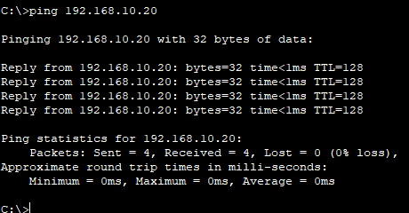

Pinging Different VLANs via router on a switch (Trunk ports)

From PC0 to PC1 (different VLANs but via port)

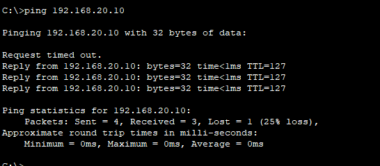

Switch0 Vlan access and trunk ports configurations

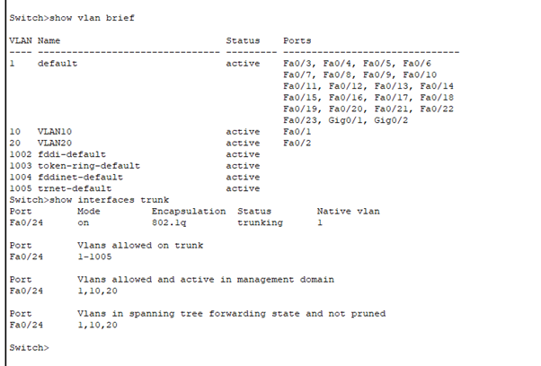

Switch1 Access and trunk ports configurations

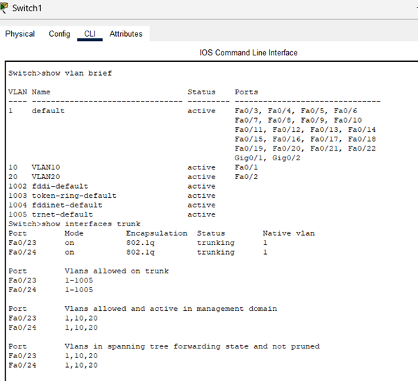

NATIVE VLAN

We can use the NATIVE VLAN as VLAN 99

On Switch0

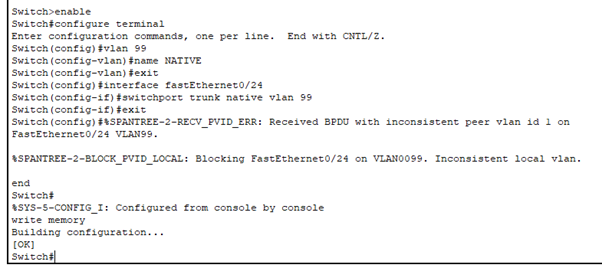

ON switch1

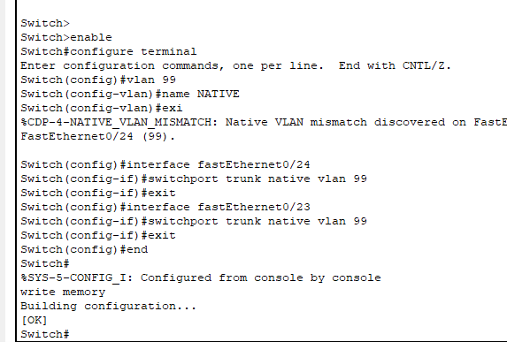

Now if we intentionally change the Switch1 native vlan to 1 (before 99), the VLAN mismatch will be found

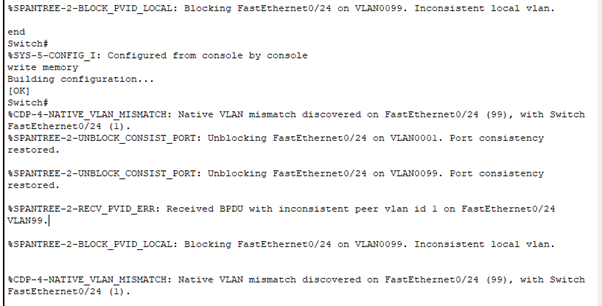

We can check this using ,, show interfaces trunk

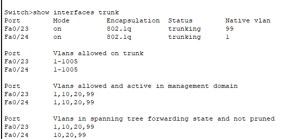

In switch 1 Native vlan is set to 1

And in Switch 0

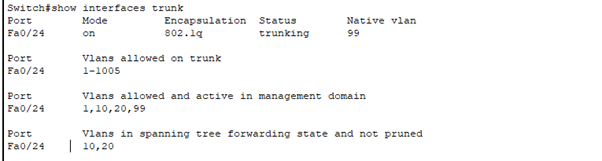

it is set to 99

So Native VLAN mismatch is found. So Change the switch 1 NATIVE VLAN to 99 in order to resolve the mismatch issue.. 

