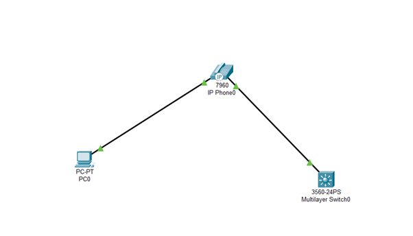
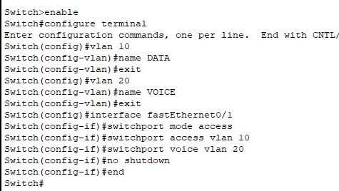
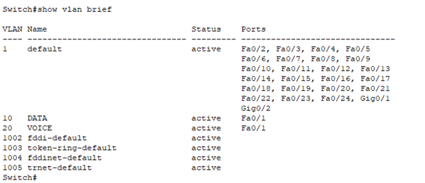

# Question 8

---

Topology

Assigning separate ports for voice and data

PC sends packet

Frame: no VLAN tag

Switch sees:

No tag → assign VLAN 10

Phone sends packet

Frame: VLAN tag = 20

Switch sees:

Already tagged → send to VLAN 20
