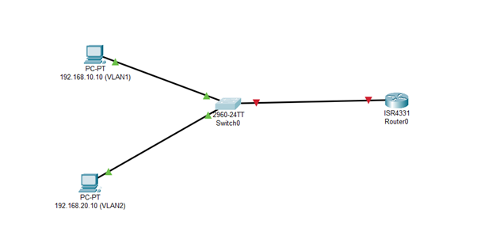
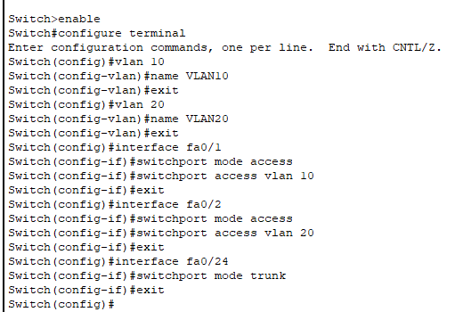
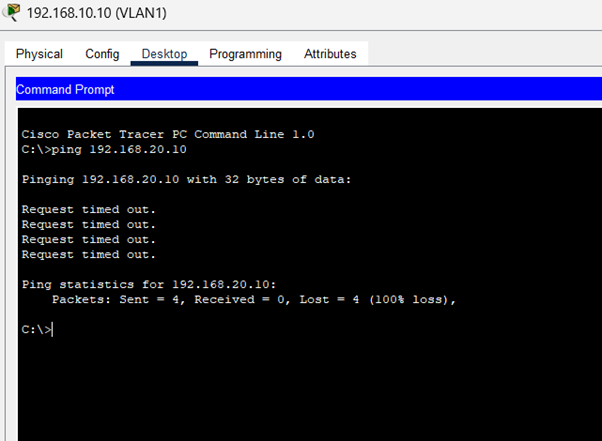
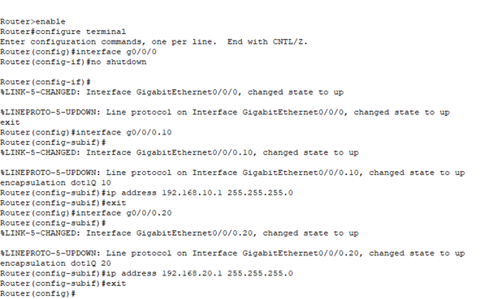
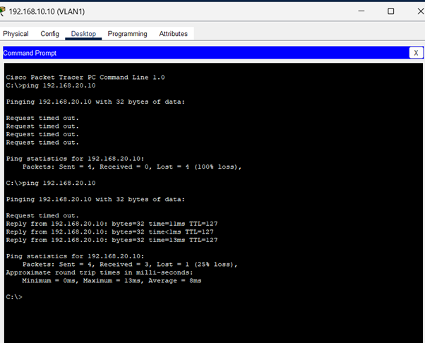

# Question 9 and 10

---

Topology

“Devices are in different VLANs, so communication fails because VLANs are isolated at Layer 2.”

Solution for this is .. having a router-on-a-stick.. Inter VLAN Routing.

Now the problem is being solved by utilizing the concept of inter VLAN routing 

