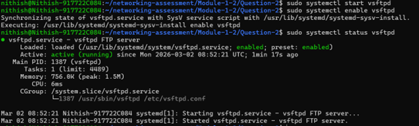
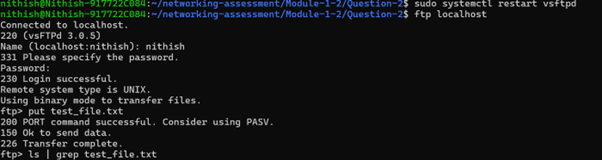
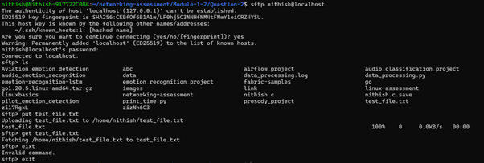

# Question 1  
## Host a FTP and SFTP server and try PUT and GET operations.

---

## Concepts Learned

### FTP (File Transfer Protocol)

The `FTP` command is used to transfer files among machines. It is not encrypted and it works on port 21.

### SFTP (SSH File Transfer Protocol) 

The `sftp` command is also used to transfer files among machine but with SSH Encryption. it works on port 22.

## Output Screenshot

### Using cp command

### Using scp command

### Saved in Destination

